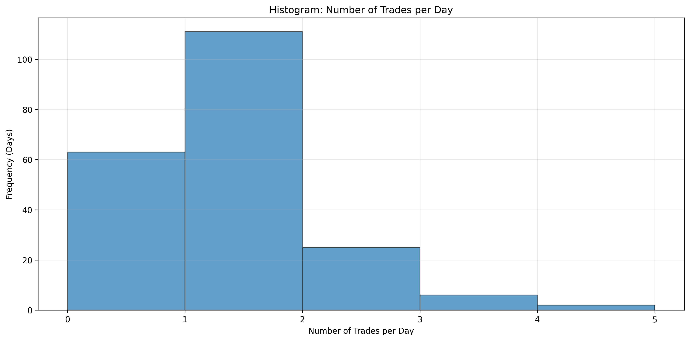
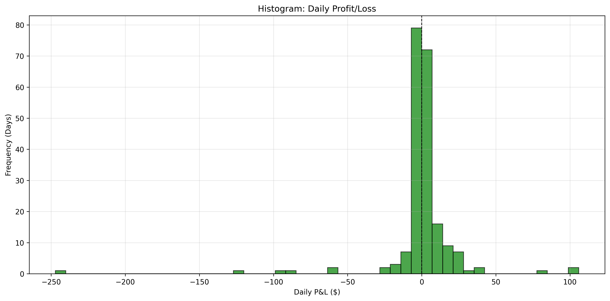
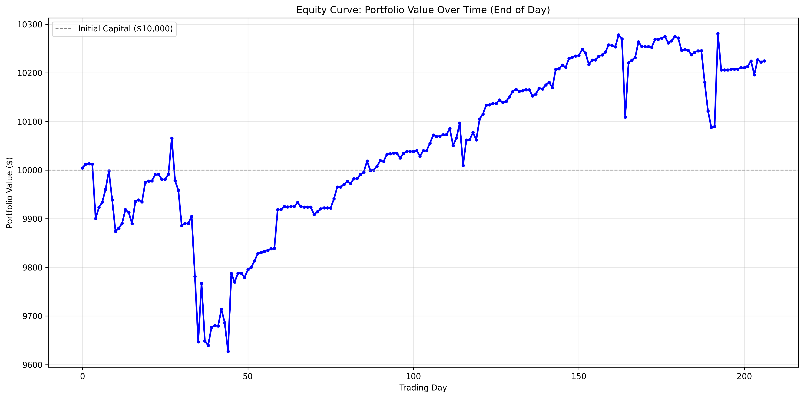
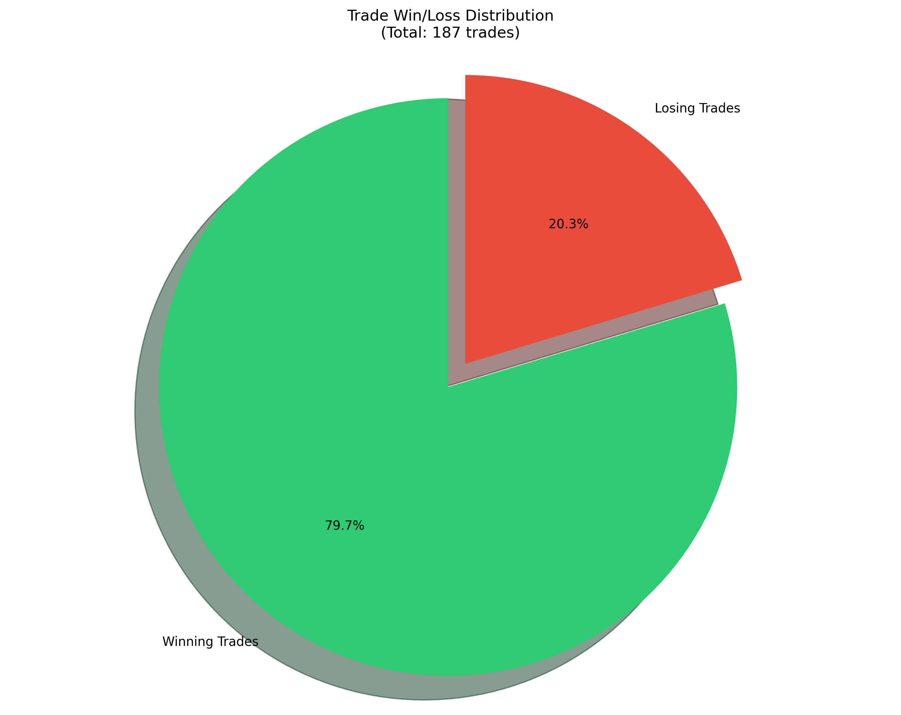
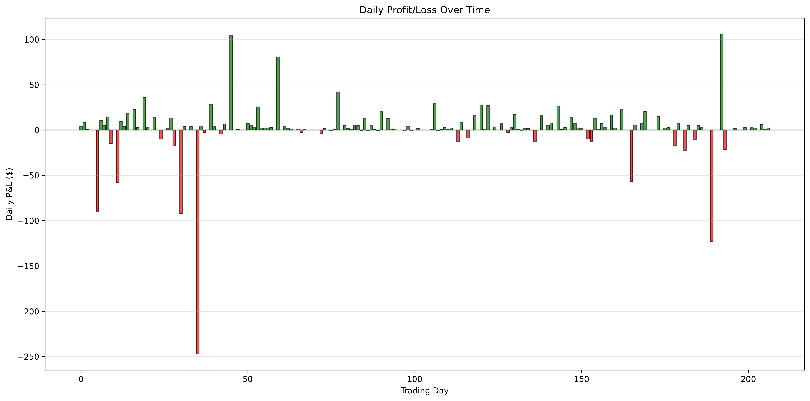
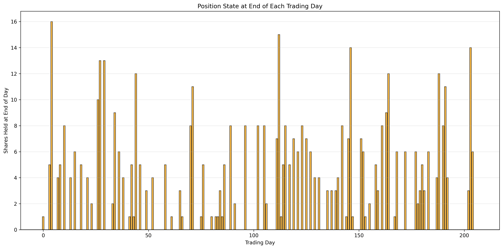

# SPX Trading Strategy Backtest Report

## Executive Summary

This report presents a comprehensive backtest analysis of a trading strategy based on SPX (S&P 500) signals from February 14, 2025 to December 11, 2025. The strategy executes trades based on Buy/Sell signals with risk filtering, tracking positions across trading days.

**Key Results:**
- **Initial Capital:** $10,000.00
- **Final Portfolio Value:** $10,224.69
- **Total Return:** 2.25% ($224.69 profit)
- **Total Trades:** 187
- **Win Rate:** 79.7% (149 wins, 38 losses)

---

## Strategy Rules

1. **Entry Signal:** Buy 1 share at `fPrice` when a Buy signal with `risk='low'` occurs
2. **Multiple Buys:** Accumulate shares (buy 1 share per Buy signal) until a Sell signal
3. **Exit Signal:** Sell ALL held shares when a Sell signal with `risk='low'` or `risk='medium'` occurs
4. **No Shorting:** Ignore Sell signals if no position exists
5. **Cross-Day Positions:** Positions carry over to next trading day if not closed
6. **Final Close:** Close any remaining position at the last signal's `fPrice` on the last day
7. **Capital Constraint:** Only buy if sufficient cash available (starting with $10,000)

---

## Performance Metrics

### Capital & Performance

| Metric | Value |
|-------|-------|
| Initial Capital | $10,000.00 |
| Final Portfolio Value | $10,224.69 |
| Total P&L | $224.69 |
| Return | 2.25% |

### Trading Days Analysis

| Metric | Count | Percentage |
|-------|-------|------------|
| Total Trading Days | 207 | 100% |
| Days with Zero Position at End | 114 | 55.1% |
| Days with Position at End | 93 | 44.9% |
| Days with Position Crossing to Next Day | 93 | 44.9% |
| Days with No Trades | 63 | 30.4% |

### Trade Statistics

| Metric | Count | Percentage |
|-------|-------|------------|
| Total Trades Executed | 187 | 100% |
| Winning Trades | 149 | 79.7% |
| Losing Trades | 38 | 20.3% |
| Average P&L per Trade | $1.20 | - |
| Average Winning Trade | $7.50 | - |
| Average Losing Trade | -$23.51 | - |

### Cross-Day Trades Analysis

| Metric | Count | Percentage |
|-------|-------|------------|
| Total Cross-Day Trades | 81 | 100% |
| Cross-Day Wins | 51 | 63.0% |
| Cross-Day Losses | 30 | 37.0% |
| Cross-Day Total P&L | -$40.93 | - |

**Key Finding:** Cross-day trades have a lower win rate (63.0%) compared to overall trades (79.7%), suggesting that holding positions overnight increases risk.

### Daily Trade Distribution

| Metric | Value |
|-------|-------|
| Min Trades per Day | 1 |
| Max Trades per Day | 4 |
| Average Trades per Day | 1.30 |
| Days with No Trades | 63 (30.4%) |

---

## Daily P&L Statistics

### Winning Days

| Statistic | Value |
|-----------|-------|
| Count | 111 days (53.6%) |
| Min | $0.01 |
| Max | $105.95 |
| Mean | $9.75 |
| Median | $3.95 |

### Losing Days

| Statistic | Value |
|-----------|-------|
| Count | 33 days (15.9%) |
| Min | -$247.14 |
| Max | -$0.05 |
| Mean | -$25.98 |
| Median | -$9.82 |

### Zero P&L Days

- **Count:** 63 days (30.4%)

**Analysis:** The strategy shows a positive skew with more winning days (53.6%) than losing days (15.9%), but losing days have larger average losses (-$25.98) compared to average wins ($9.75), indicating asymmetric risk-reward.

---

## Big Losing Days Analysis (Loss > $50)

The following table shows all trading days with losses exceeding $50:

| Date | Loss | Characteristics |
|------|------|----------------|
| 2025-04-07 | -$247.14 | Cross-day position closed |
| 2025-11-14 | -$123.30 | Cross-day position closed |
| 2025-03-31 | -$92.33 | Cross-day position closed |
| 2025-02-24 | -$89.65 | Cross-day position closed, **Limited by funds** (missed 2 buy signals, cash at start: $302.27) |
| 2025-03-04 | -$58.27 | Cross-day position closed |
| 2025-10-13 | -$57.28 | Cross-day position closed |

### Key Findings:

1. **All big losing days closed cross-day positions** - This confirms that holding positions overnight significantly increases the risk of large losses.

2. **Only 1 of 6 big losing days was limited by funds:**
   - **2025-02-24**: Started with only $302.27 cash and missed 2 buy signals due to insufficient funds
   - The other 5 big losing days had sufficient capital, indicating losses were due to market movement rather than capital constraints

3. **Largest single-day loss:** -$247.14 on 2025-04-07

---

## Visualizations

The following visualizations provide graphical insights into the strategy performance:

### 1. Trades per Day Histogram

Shows the distribution of number of trades executed per trading day. Most days have 1 trade, with some days having up to 4 trades.

### 2. Daily P&L Histogram

Distribution of daily profit/loss. Shows the frequency of different P&L ranges, with most days showing small positive returns.

### 3. Equity Curve

Portfolio value over time (end of day). Shows the progression of portfolio value from $10,000 to $10,224.69 over 207 trading days.

### 4. Trade Win/Loss Distribution

Pie chart showing the proportion of winning (79.7%) vs losing (20.3%) trades.

### 5. Daily P&L Over Time

Bar chart showing daily profit/loss over the entire backtest period. Green bars indicate profitable days, red bars indicate losing days.

### 6. Daily Positions

Shows the number of shares held at the end of each trading day. Helps visualize when positions were carried overnight.

---

## Risk Analysis

### Position Management

- **Days with zero position at end:** 114 (55.1%)
- **Days with position crossing to next day:** 93 (44.9%)

The strategy frequently holds positions overnight, which increases exposure to overnight market movements.

### Capital Utilization

- **Days with no trades:** 63 (30.4%)
- **Capital constraints:** Only 1 big losing day was limited by funds

The strategy maintains sufficient capital reserves, with most missed opportunities occurring on days with no trades rather than due to capital constraints.

### Drawdown Analysis

The largest single-day loss was -$247.14 (2.47% of initial capital). The strategy recovered from this loss, ending with a positive return.

---

## Conclusions

1. **Overall Performance:** The strategy generated a modest 2.25% return over 207 trading days, with a high win rate of 79.7%.

2. **Risk Characteristics:**
   - High win rate but asymmetric risk-reward (larger average losses than wins)
   - Cross-day positions show lower win rate (63.0%) compared to same-day trades
   - All major losses (>$50) occurred when closing cross-day positions

3. **Capital Management:**
   - Strategy maintains adequate capital reserves
   - Only one major loss day was constrained by insufficient funds
   - Most trading days (69.6%) executed at least one trade

4. **Recommendations:**
   - Consider reducing overnight position exposure to mitigate large losses
   - Implement stop-loss mechanisms for cross-day positions
   - Monitor capital utilization to avoid missing opportunities

---

## Technical Details

- **Data Period:** February 14, 2025 - December 11, 2025
- **Total Trading Days:** 207
- **Total Signals Processed:** 2,362
- **Backtest Script:** `backtest_strategy.py` (in DiscordPicExtract folder)
- **Data Source:** `combined_data.csv` (in DiscordPicExtract folder)
- **Daily CSV Files:** Individual daily CSV files are stored in `Desktop/SPXsignal/` folder

---

## Files Included

- `backtest_strategy.py` - Python script implementing the backtest
- `combined_data.csv` - Combined trading signals data
- `BACKTEST_REPORT.md` - This report
- All visualization PNG files (6 charts)

---

*Report generated on: December 2025*

