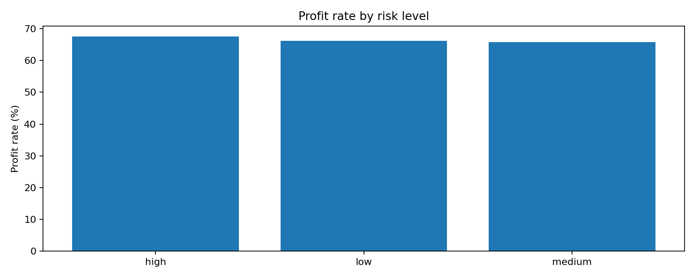
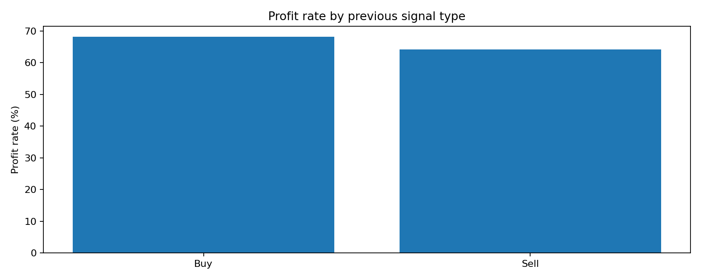
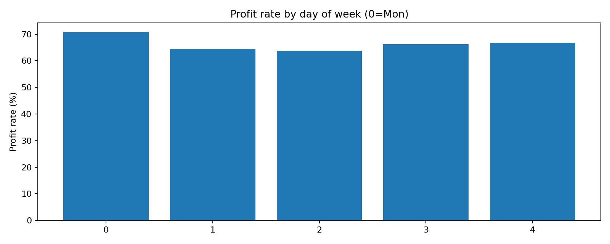
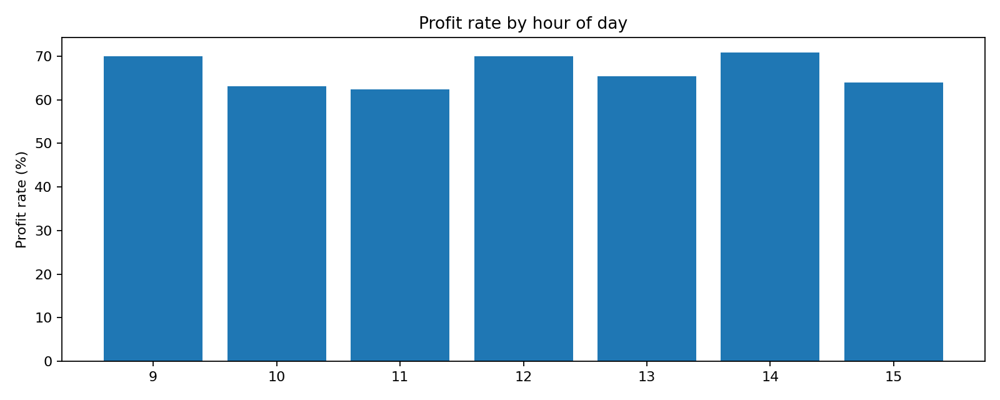
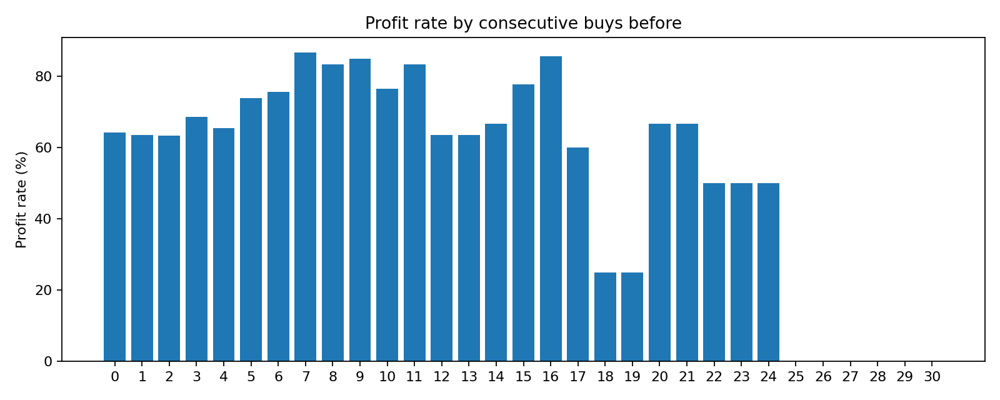
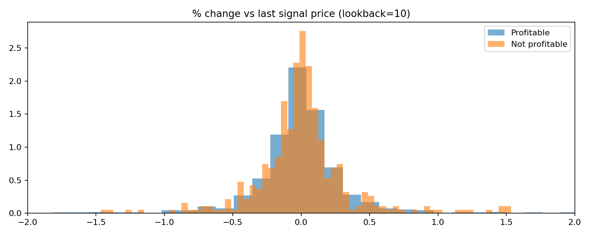
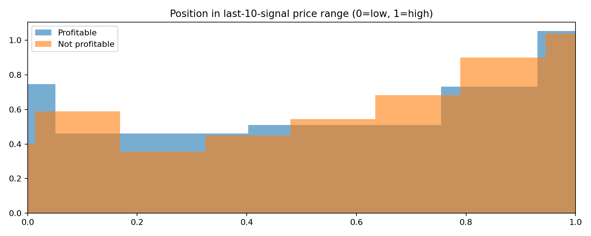
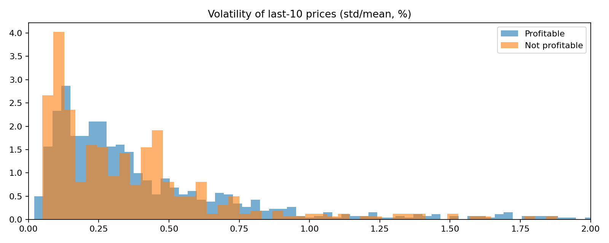

# Buy Signal Characteristics (Buy-Time Only) — Profitable vs Not Profitable

This report answers: **"For the 33.69% of buy signals that don't result in profitable sells, what characteristics do they have, and what do the profitable ones differ?"** while **avoiding future-peeking** in the features.

## Definition (what "profitable" means here)

We use your existing labels from `all_buy_profitability_analysis.csv` (generated by `analyze_all_buy_profitability.py`):

- A buy is **profitable** if the analysis found a **profitable sell opportunity** under its rules (Patterns 1–4, or "Other" based on the script's search window/logic).
- A buy is **not profitable** otherwise.

Important: the **features** below only use **information available at the moment of the buy** (lookback on prior signals only). The label is historical and used only for grouping/contrast.

## Dataset summary

- **Total buys**: 1232  
- **Profitable**: 817 (**66.31%**)  
- **Not profitable**: 415 (**33.69%**)  

Outputs generated:
- `analysis_outputs/buy_realtime_features.csv` (buy-time features + label)
- Tables in `analysis_outputs/*.csv`
- Charts in `analysis_charts/*.png`

---

## High-signal comparisons (tables)

### Profit rate by risk level

| risk | n | profit rate |
|---|---:|---:|
| low | 889 | 66.14% |
| medium | 143 | 65.73% |
| high | 200 | 67.50% |

Observation: **risk label alone doesn't separate profitable vs not-profitable strongly** (all ~66%).

### Profit rate by previous signal type

| previous signal | n | profit rate |
|---|---:|---:|
| Buy | 659 | 68.13% |
| Sell | 572 | 64.16% |

Observation: buys that occur **after a buy** have a modestly higher profit rate in this label definition.

### Profit rate by day of week (0=Mon)

| dow | n | profit rate |
|---:|---:|---:|
| 0 | 236 | 70.76% |
| 1 | 276 | 64.49% |
| 2 | 260 | 63.85% |
| 3 | 225 | 66.22% |
| 4 | 235 | 66.81% |

Observation: Monday is highest here, but differences are **not huge**.

### Profit rate by consecutive buys immediately before this buy

This uses only prior signals at buy time: how many consecutive buys appear immediately before the current buy.

Key rows (full table saved to `analysis_outputs/rate_by_consecutive_buys_before.csv`):

| consecutive buys before | n | profit rate |
|---:|---:|---:|
| 0 | 573 | 64.22% |
| 1 | 162 | 63.58% |
| 2 | 101 | 63.37% |
| 3 | 70 | 68.57% |
| 5 | 46 | 73.91% |
| 6 | 41 | 75.61% |
| 7 | 30 | 86.67% |

Observation: profit rate appears to rise with more consecutive buys **up to moderate counts**, but note **small sample sizes** as the streak length increases.

---

## Numeric feature differences (buy-time only)

Lookback window: **last 10 signals prior to the buy**.

Top differences by absolute Cohen's d (effect size) — see `analysis_outputs/realtime_feature_comparison_numeric.csv` for full values:

| feature | profitable mean | not-profitable mean | mean diff | Cohen's d |
|---|---:|---:|---:|---:|
| `lb_slope` | -0.0298 | 0.0884 | -0.1183 | -0.1456 |
| `lb_sells` | 4.4969 | 4.8578 | -0.3609 | -0.1203 |
| `lb_buys` | 5.4357 | 5.1422 | +0.2936 | +0.0978 |
| `pos_in_range` | 0.5337 | 0.5933 | -0.0596 | -0.0958 |

Interpretation (still **not a prediction rule**; just group differences):
- **Not-profitable buys tend to occur after a more upward-sloping recent window** (`lb_slope` higher).  
- **Profitable buys tend to occur slightly "lower in the recent range"** (`pos_in_range` lower).  
- The magnitude is **small** (Cohen's d ~0.10–0.15), meaning these are **weak signals alone**.

---

## Charts

### Profit-rate charts

These charts show the profit rate (percentage of buy signals that resulted in profitable sells) across different categorical features. Each bar represents a category, and the height shows the profit rate for that category.

#### Profit Rate by Risk Level

**Explanation**: This chart compares profit rates across low, medium, and high risk buy signals. The bars show that all risk levels have similar profit rates (~66%), indicating that risk level alone is not a strong discriminator for profitability. This suggests that other factors beyond the risk label play a more significant role in determining whether a buy signal will be profitable.

#### Profit Rate by Previous Signal Type

**Explanation**: This chart shows whether the immediately preceding signal was a Buy or Sell. Buy signals that follow another Buy signal show a slightly higher profit rate (68.13%) compared to those following a Sell signal (64.16%). This modest difference suggests that consecutive buy signals may indicate stronger momentum or accumulation patterns that lead to better outcomes.

#### Profit Rate by Day of Week

**Explanation**: This chart displays profit rates for each trading day (Monday=0 through Friday=4). Monday shows the highest profit rate (70.76%), while Tuesday and Wednesday show the lowest (~64%). This pattern might reflect weekly market dynamics, such as Monday momentum from weekend news or end-of-week positioning effects. However, the differences are relatively modest, indicating day-of-week effects are weak.

#### Profit Rate by Hour of Day

**Explanation**: This chart shows profit rates by the hour of day when the buy signal occurred (within trading hours 9:30 AM - 4:00 PM). This helps identify if certain times of day are more favorable for buy signals. Patterns here might reveal intraday momentum effects or market microstructure influences.

#### Profit Rate by Consecutive Buys

**Explanation**: This chart shows profit rates based on how many consecutive Buy signals occurred immediately before the current buy. The x-axis represents the number of consecutive buys (0, 1, 2, 3, etc.), and the y-axis shows the profit rate. The chart reveals an interesting pattern: profit rates tend to increase with longer streaks of consecutive buys, particularly for streaks of 5-7 consecutive buys. However, note that sample sizes decrease as streak length increases, so caution is needed when interpreting the highest streak values.

### Distribution charts (profitable vs not profitable)

These charts overlay the distributions of numeric features for profitable vs not-profitable buy signals. The y-axis uses normalized histogram density, making the shapes comparable even when the counts differ.

#### How to read these 3 distribution charts

All three plots overlay **Profitable** vs **Not profitable** buy signals. The **features** are computed using only **past information at the moment of the buy** (lookback on prior signals only). The y-axis is a **normalized histogram density** (so shapes are comparable even if counts differ).

##### 1) `dist_pct_from_last.png` — "% change vs last signal price"

- **What it measures**: how much the buy's `fPrice` differs from the **immediately previous signal's** `fPrice`:

\[
\text{pct\_from\_last}=\frac{\text{buy\_price}-\text{prev\_signal\_price}}{\text{prev\_signal\_price}}\times 100
\]

- **What to look for**: if profitable buys tend to happen after a short-term drop (more mass on the negative side) or after a pop (positive side).
- **What we see**: the two curves **overlap heavily** and are centered near **0%**.
- **Takeaway**: the immediate tick from the prior signal is **not a strong separator** of profitable vs not-profitable buys in this dataset.

**Visual interpretation**: Both profitable (typically shown in green/blue) and not-profitable (typically shown in red/orange) distributions are centered around 0%, meaning most buy signals occur at prices very close to the immediately preceding signal. The heavy overlap indicates this feature alone cannot reliably distinguish between profitable and not-profitable buys.

##### 2) `dist_pos_in_range.png` — "Position in last-10-signal price range (0=low, 1=high)"

- **What it measures**: where the buy price sits relative to the **min/max of the previous 10 signals**:

\[
\text{pos\_in\_range}=\frac{\text{buy\_price}-\min(\text{prev10})}{\max(\text{prev10})-\min(\text{prev10})}
\]

- **How to read**:
  - **0** = buying at the recent low
  - **1** = buying at the recent high
- **What we see**: the **not-profitable** distribution is shifted slightly toward **higher** values (more "buying high"), while the **profitable** distribution has slightly more weight at **lower** values.
- **Takeaway**: buying **lower in the recent range** helps a bit, but overlap is still large (it's a **weak edge**, not a clean filter).

**Visual interpretation**: The not-profitable distribution (red/orange) shows more density on the right side (values closer to 1.0), indicating these buys tend to occur at higher prices within the recent 10-signal range. The profitable distribution (green/blue) shows slightly more density on the left side (values closer to 0.0), suggesting buying near recent lows is marginally better. However, the significant overlap means this is a weak signal that should be combined with other features.

##### 3) `dist_vol_pct.png` — "Volatility of last-10 prices (std/mean, %)"

- **What it measures**: volatility in the previous 10 signals, computed as:

\[
\text{lb\_vol\_pct}=\frac{\text{std}(\text{prev10})}{\text{mean}(\text{prev10})}\times 100
\]

- **What we see**: both profitable and not-profitable buys occur across similar volatility levels, with strong overlap and a long right tail.
- **Takeaway**: recent volatility (last 10 signals) is **not a strong standalone discriminator** here; at best it's a secondary/context feature.

**Visual interpretation**: Both distributions show similar shapes with a long right tail, indicating that most buy signals occur during periods of moderate volatility, but some occur during high-volatility periods. The distributions overlap significantly, meaning volatility alone cannot distinguish profitable from not-profitable buys. The long right tail suggests occasional high-volatility periods don't strongly favor either group.

---

## What "not profitable" buys look like (in this framework)

Based on buy-time-only features and the label definition:

- **Slightly more "buying high" behavior** (higher `pos_in_range` on average).
- **Slightly more positive recent slope** (`lb_slope` higher).
- **Slightly more sells in the last-10 signals** (`lb_sells` higher).

But again: **no single buy-time feature cleanly separates the 33.69%** from the 66.31%—the differences are real but modest.

---

## Files produced

- `analysis_outputs/buy_realtime_features.csv`
- `analysis_outputs/realtime_feature_comparison_numeric.csv`
- `analysis_outputs/rate_by_risk.csv`
- `analysis_outputs/rate_by_hour.csv`
- `analysis_outputs/rate_by_dow.csv`
- `analysis_outputs/rate_by_prev_signal.csv`
- `analysis_outputs/rate_by_consecutive_buys_before.csv`
- `analysis_charts/*.png`

