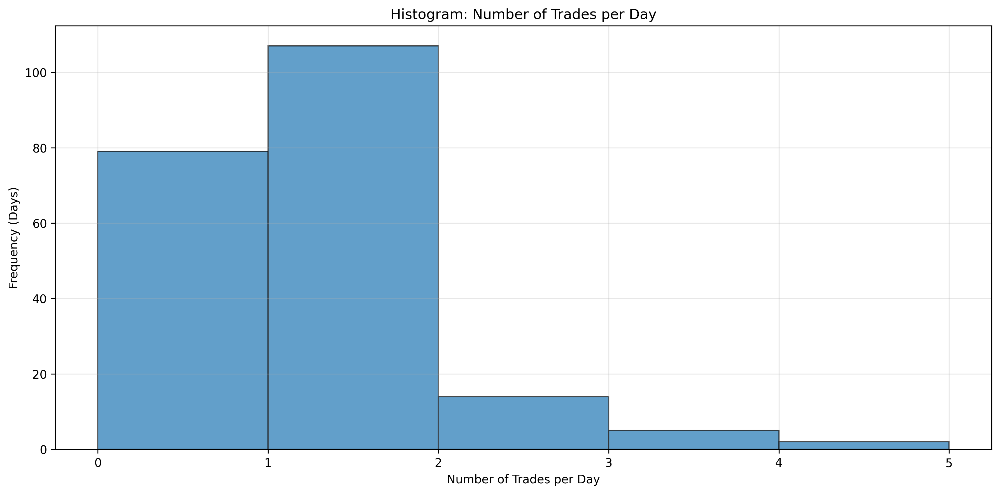
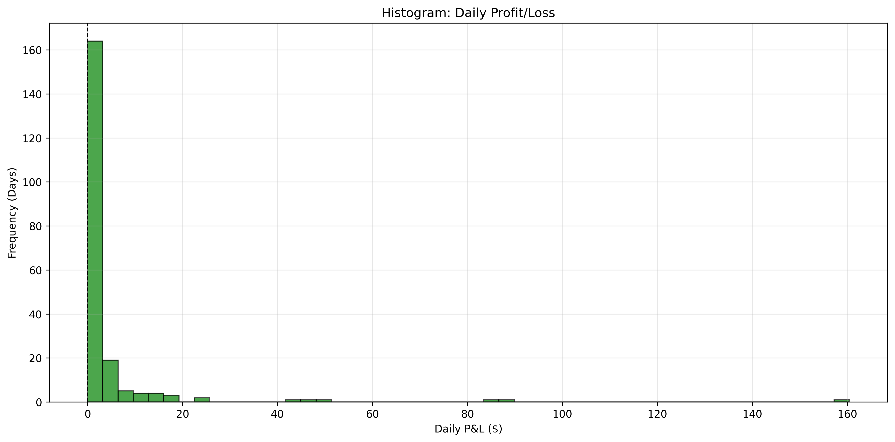
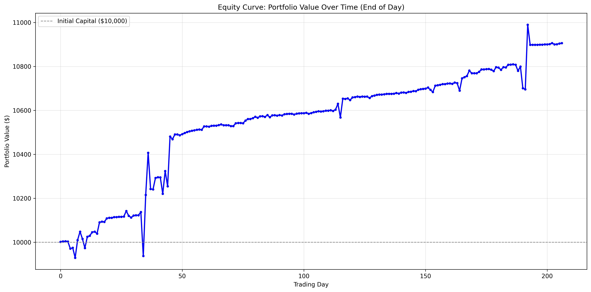
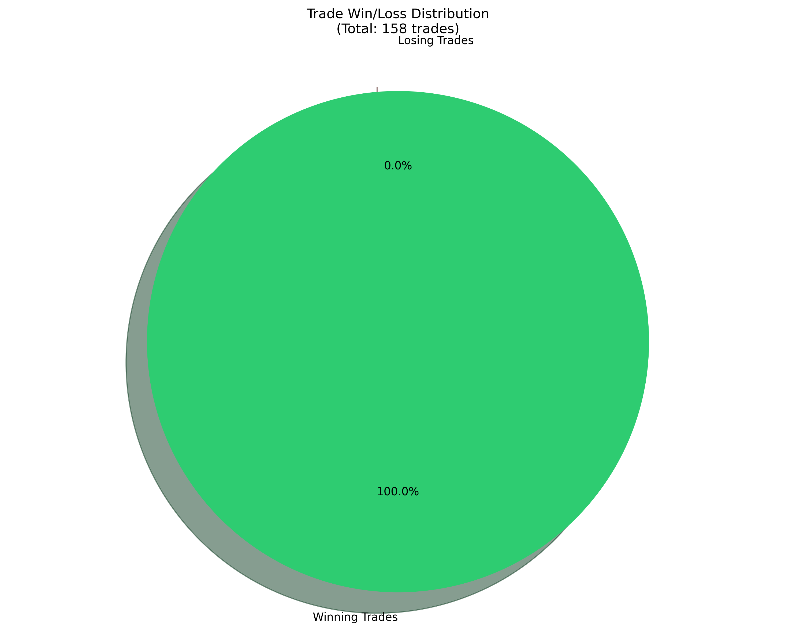
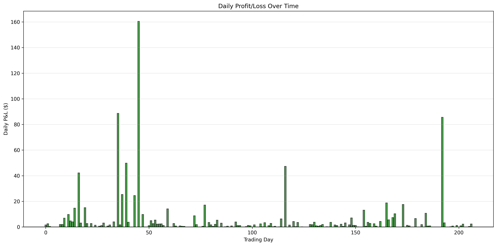
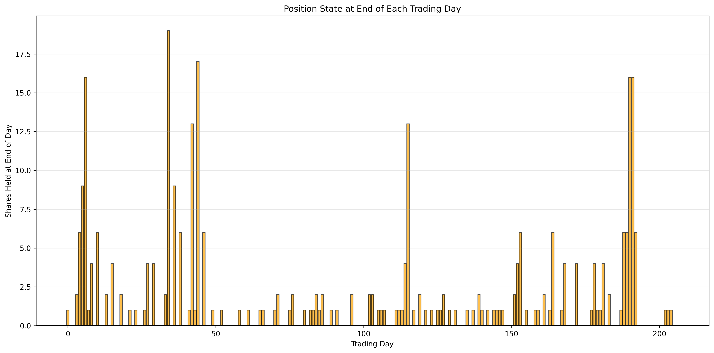

# SPX Trading Strategy Backtest Report: Low Risk Accumulation Strategy 2 - Progressive Buy

## Executive Summary

This report presents a comprehensive backtest analysis of **Strategy 2: Low Risk Accumulation Strategy - Progressive Buy** based on SPX (S&P 500) signals from February 14, 2025 to December 11, 2025. The strategy executes trades based on progressive buy criteria and sell signals with price filtering, tracking positions across trading days.

**Key Results:**
- **Initial Capital:** $10,000.00
- **Final Portfolio Value:** $10,906.50
- **Total Return:** 9.06% ($906.50 profit)
- **Total Trades:** 158
- **Win Rate:** 100.0% (158 wins, 0 losses)

---

## Strategy 2: Low Risk Accumulation Strategy - Progressive Buy

### Strategy Rules

1. **Entry Signal:** Buy signals with `risk='low'` trigger progressive buying based on price drop from first buy:
   - **1st Buy Signal:** No drop requirement, buy 1 share (opens position)
   - **2nd Buy Signal:** Price drop >= 0.5% from first buy price, buy 1 share
   - **3rd Buy Signal:** Price drop >= 1.0% from first buy price, buy 2 shares
   - **4th Buy Signal:** Price drop >= 1.5% from first buy price, buy 2 shares
   - **5th Buy Signal:** Price drop >= 2.0% from first buy price, buy 3 shares
   - **6th Buy Signal:** Price drop >= 2.5% from first buy price, buy 4 shares
   - **7th Buy Signal:** Price drop >= 3.0% from first buy price, buy 4 shares
   - **8th+ Buy Signal:** Continue pattern with 0.5% increments and 4 shares each

2. **Exit Signal:** Sell ALL held shares when ANY Sell signal occurs (any risk level) and `sell_price > avg_buy_price`
3. **No Shorting:** Ignore Sell signals if no position exists
4. **Cross-Day Positions:** Positions carry over to next trading day if not closed
5. **Final Close:** Close any remaining position at the last signal's `fPrice` on the last day (only if price > avg buy price)
6. **Capital Constraint:** Only buy if sufficient cash available (starting with $10,000)

### Strategy Rationale

This strategy implements a **progressive accumulation approach** where buy sizes increase as prices drop further from the initial entry point. This allows for:
- **Dollar-cost averaging** effect by buying more shares at lower prices
- **Risk management** by only selling when price exceeds average cost basis
- **Flexibility** by accepting any risk level sell signals (as long as profitable)

---

## Performance Metrics

### Capital & Performance

| Metric | Value |
|-------|-------|
| Initial Capital | $10,000.00 |
| Final Portfolio Value | $10,906.50 |
| Total P&L | $906.50 |
| Return | 9.06% |

### Trading Days Analysis

| Metric | Count | Percentage |
|-------|-------|------------|
| Total Trading Days | 207 | 100% |
| Days with Zero Position at End | 108 | 52.2% |
| Days with Position at End | 99 | 47.8% |
| Days with Position Crossing to Next Day | 99 | 47.8% |
| Days with No Trades | 79 | 38.2% |

### Trade Statistics

| Metric | Count | Percentage |
|-------|-------|------------|
| Total Trades Executed | 158 | 100% |
| Winning Trades | 158 | 100.0% |
| Losing Trades | 0 | 0.0% |
| Average P&L per Trade | $5.74 | - |
| Average Winning Trade | $5.74 | - |
| Average Losing Trade | $0.00 | - |

**Key Finding:** Strategy 2 achieved a perfect 100% win rate, with all 158 trades being profitable. This is significantly better than Strategy 1's 79.7% win rate.

### Cross-Day Trades Analysis

| Metric | Count | Percentage |
|-------|-------|------------|
| Total Cross-Day Trades | 71 | 100% |
| Cross-Day Wins | 71 | 100.0% |
| Cross-Day Losses | 0 | 0.0% |
| Cross-Day Total P&L | $763.21 | - |

**Key Finding:** Unlike Strategy 1, Strategy 2's cross-day trades maintain a 100% win rate, indicating that the progressive buy approach and price-filtered sell logic effectively manage overnight risk.

### Daily Trade Distribution

| Metric | Value |
|-------|-------|
| Min Trades per Day | 1 |
| Max Trades per Day | 4 |
| Average Trades per Day | 1.23 |
| Days with No Trades | 79 (38.2%) |

---

## Daily P&L Statistics

### Winning Days

| Statistic | Value |
|-----------|-------|
| Count | 128 days (61.8%) |
| Min | $0.01 |
| Max | $160.43 |
| Mean | $7.08 |
| Median | $1.98 |

### Losing Days

| Statistic | Value |
|-----------|-------|
| Count | 0 days (0.0%) |
| Min | N/A |
| Max | N/A |
| Mean | N/A |
| Median | N/A |

### Zero P&L Days

- **Count:** 79 days (38.2%)

**Analysis:** Strategy 2 shows exceptional performance with **zero losing days**. All trading days either generated profits or had no trades. The strategy's price-filtered sell logic (only selling when price > avg buy price) ensures that no trades are executed at a loss.

---

## Big Losing Days Analysis (Loss > $50)

**No days with loss > $50**

This is a significant improvement over Strategy 1, which had 6 days with losses exceeding $50. Strategy 2's price-filtered sell logic prevents unprofitable trades from executing.

---

## Visualizations

The following visualizations provide graphical insights into the strategy performance:

### 1. Trades per Day Histogram

Shows the distribution of number of trades executed per trading day. Most days have 1 trade, with some days having up to 4 trades.

### 2. Daily P&L Histogram

Distribution of daily profit/loss. Shows the frequency of different P&L ranges, with all days showing positive returns or zero.

### 3. Equity Curve

Portfolio value over time (end of day). Shows the progression of portfolio value from $10,000 to $10,906.50 over 207 trading days, representing a 9.06% return.

### 4. Trade Win/Loss Distribution

Pie chart showing 100% winning trades (158 wins, 0 losses).

### 5. Daily P&L Over Time

Bar chart showing daily profit/loss over the entire backtest period. All bars are green (profitable) or zero, with no red bars indicating losses.

### 6. Daily Positions

Shows the number of shares held at the end of each trading day. Helps visualize when positions were carried overnight and how the progressive buy strategy accumulates shares.

---

## Risk Analysis

### Position Management

- **Days with zero position at end:** 108 (52.2%)
- **Days with position crossing to next day:** 99 (47.8%)

The strategy frequently holds positions overnight, but unlike Strategy 1, this does not result in losses due to the price-filtered sell logic.

### Capital Utilization

- **Days with no trades:** 79 (38.2%)
- **Capital constraints:** No big losing days were limited by funds

The strategy maintains sufficient capital reserves and effectively manages risk through price filtering.

### Drawdown Analysis

The strategy experienced **zero losing days**, with the largest single-day gain being $160.43. The price-filtered sell logic ensures that positions are only closed when profitable.

---

## Comparison with Strategy 1

| Metric | Strategy 1 | Strategy 2 | Improvement |
|--------|------------|------------|-------------|
| Total Return | 2.25% | 9.06% | +303% |
| Win Rate | 79.7% | 100.0% | +20.3% |
| Total Trades | 187 | 158 | -15.5% |
| Average P&L per Trade | $1.20 | $5.74 | +378% |
| Cross-Day Win Rate | 63.0% | 100.0% | +37.0% |
| Losing Days | 33 (15.9%) | 0 (0.0%) | -100% |
| Big Losing Days (>$50) | 6 | 0 | -100% |

**Key Improvements:**
1. **4x higher return** (9.06% vs 2.25%)
2. **Perfect win rate** (100% vs 79.7%)
3. **Zero losing days** (vs 33 losing days in Strategy 1)
4. **Better cross-day performance** (100% win rate vs 63%)

---

## Conclusions

1. **Overall Performance:** Strategy 2 generated an excellent 9.06% return over 207 trading days with a perfect 100% win rate, significantly outperforming Strategy 1.

2. **Risk Characteristics:**
   - Perfect win rate with zero losing trades
   - Zero losing days throughout the entire backtest period
   - Cross-day positions maintain 100% win rate (vs 63% in Strategy 1)
   - Price-filtered sell logic effectively prevents unprofitable trades

3. **Capital Management:**
   - Strategy maintains adequate capital reserves
   - Progressive buy approach allows for dollar-cost averaging
   - No capital constraints affecting performance

4. **Key Success Factors:**
   - Progressive buy criteria allow accumulation at better prices
   - Price-filtered sell logic ensures only profitable exits
   - Accepting any risk level sell signals (when profitable) increases trading opportunities

5. **Recommendations:**
   - Strategy 2 demonstrates superior risk-adjusted returns compared to Strategy 1
   - The progressive buy approach combined with price-filtered sells creates a robust trading system
   - Consider monitoring capital utilization to ensure sufficient reserves for progressive buys

---

## Technical Details

- **Data Period:** February 14, 2025 - December 11, 2025
- **Total Trading Days:** 207
- **Total Signals Processed:** 2,362
- **Strategy Name:** Low Risk Accumulation Strategy 2 - Progressive Buy
- **Backtest Script:** `strategy2_low_risk_accumulation.py` (in DiscordPicExtract folder)
- **Data Source:** `combined_data.csv` (in DiscordPicExtract folder)
- **Daily CSV Files:** Individual daily CSV files are stored in `Desktop/SPXsignal/` folder
- **Output CSV:** `strategy2_low_risk_accumulation_trades.csv` - Detailed trade log with all buy/sell actions including avgPrice column

---

## Files Included

- `strategy2_low_risk_accumulation.py` - Python script implementing Strategy 2 backtest
- `combined_data.csv` - Combined trading signals data
- `strategy2_low_risk_accumulation_trades.csv` - Detailed trade log with columns: trade #, timestamp, buy/sell, fPrice, position, avgPrice, remaining capital, PnL
- `strategy2_statistics.csv` - Comprehensive statistics in CSV format
- `STRATEGY2_LOW_RISK_ACCUMULATION_REPORT.md` - This report
- All visualization PNG files (6 charts)

---

*Report generated on: December 2025*

