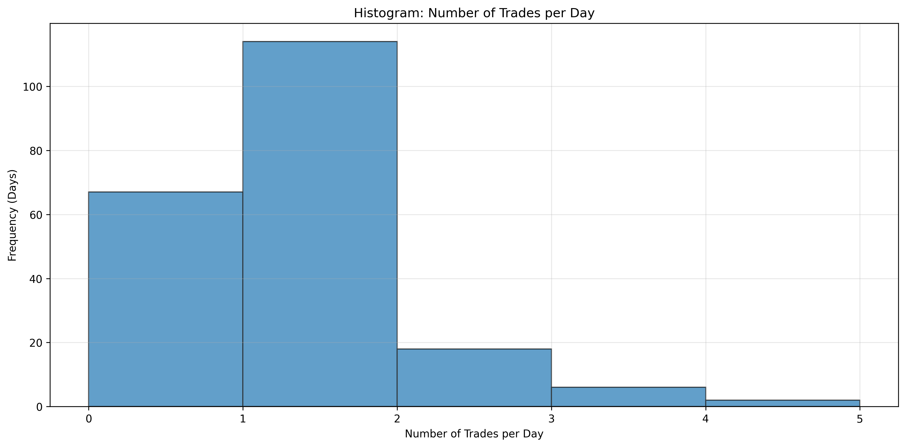
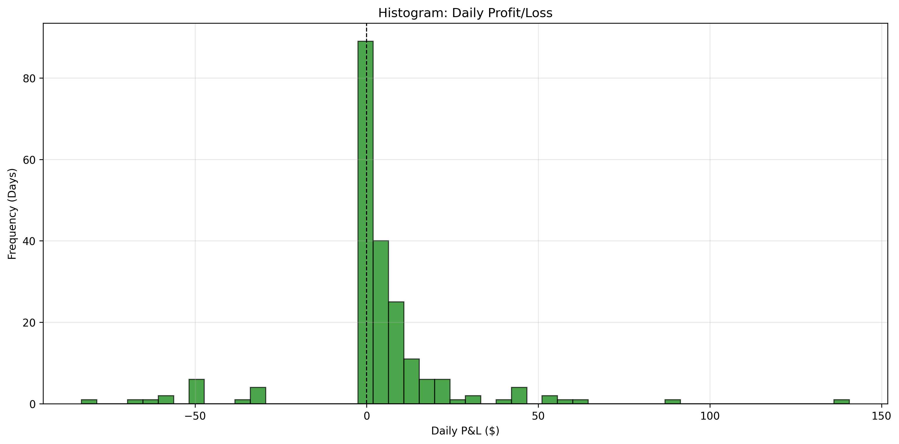
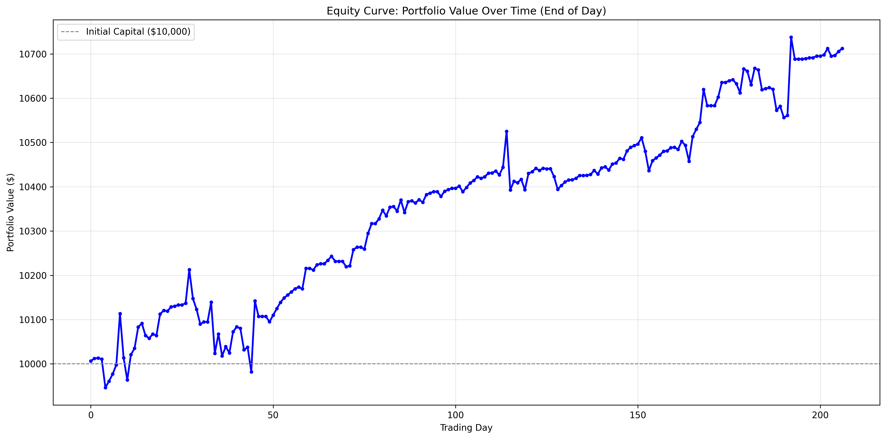
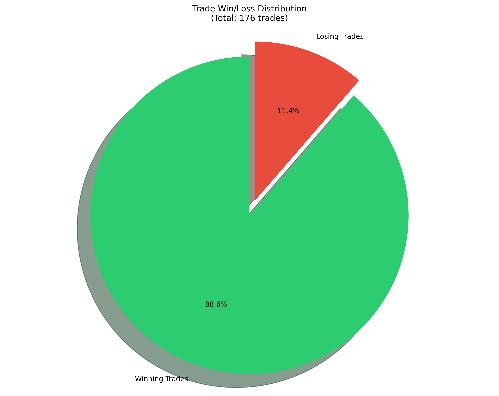
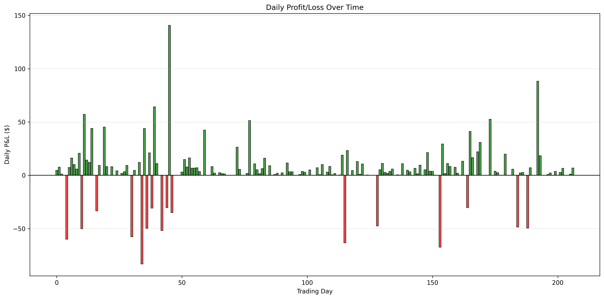
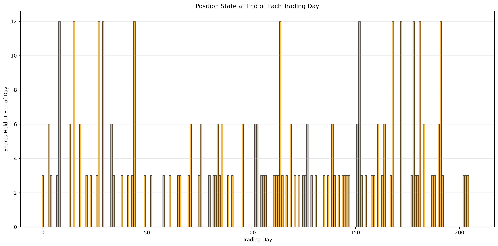

# SPX Trading Strategy Backtest Report: Low Risk Accumulation Strategy 3 - Progressive Buy with 1.5% Stop-Loss

## Executive Summary

This report presents a comprehensive backtest analysis of **Strategy 3: Low Risk Accumulation Strategy - Progressive Buy with 1.5% Stop-Loss** based on SPX (S&P 500) signals from February 14, 2025 to December 11, 2025. The strategy executes trades based on progressive buy criteria with a stop-loss mechanism and sell signals with price filtering, tracking positions across trading days.

**Key Results:**
- **Initial Capital:** $10,000.00
- **Final Portfolio Value:** $10,712.49
- **Total Return:** 7.12% ($712.49 profit)
- **Total Trades:** 176
- **Win Rate:** 88.6% (156 wins, 20 losses)
- **Stop-Loss Triggered:** 20 trades (11.4%)

---

## Strategy 3: Low Risk Accumulation Strategy - Progressive Buy with 1.5% Stop-Loss

### Strategy Rules

1. **Entry Signal:** Buy signals with `risk='low'` trigger progressive buying based on price drop from first buy:
   - **1st Buy Signal:** No drop requirement, buy 3 shares (opens position)
   - **2nd Buy Signal:** Price drop >= 0.5% from first buy price, buy 3 shares
   - **3rd Buy Signal:** Price drop >= 1.0% from first buy price, buy 6 shares
   - **Maximum Accumulation:** Up to 1.0% drop (12 shares total: 3+3+6)

2. **Stop-Loss:** If price drops >= 1.5% from first buy price, execute stop-loss:
   - Sell ALL shares at exactly 1.5% below first buy price
   - Skip the buy signal that triggered the stop-loss (prevents back-to-back stop-losses)
   - Reset position state and wait for next buy signal

3. **Exit Signal:** Sell ALL held shares when ANY Sell signal occurs (any risk level) and `sell_price > avg_buy_price`

4. **No Shorting:** Ignore Sell signals if no position exists

5. **Cross-Day Positions:** Positions carry over to next trading day if not closed

6. **Final Close:** Close any remaining position at the last signal's `fPrice` on the last day (check stop-loss first, then sell if price > avg buy price)

7. **Capital Constraint:** Only buy if sufficient cash available (starting with $10,000)

### Strategy Rationale

This strategy implements a **progressive accumulation approach with risk management**:
- **Larger initial positions** (3 shares vs 1 share in Strategy 2) for better capital utilization
- **Tighter accumulation range** (up to 1.0% drop vs 3.0% in Strategy 2) to limit downside exposure
- **Stop-loss protection** at 1.5% drop to prevent large losses
- **Dollar-cost averaging** effect by buying more shares at lower prices
- **Risk management** through stop-loss and price-filtered sells

---

## Performance Metrics

### Capital & Performance

| Metric | Value |
|-------|-------|
| Initial Capital | $10,000.00 |
| Final Portfolio Value | $10,712.49 |
| Total P&L | $712.49 |
| Return | 7.12% |

### Trading Days Analysis

| Metric | Count | Percentage |
|-------|-------|------------|
| Total Trading Days | 207 | 100% |
| Days with Zero Position at End | 115 | 55.6% |
| Days with Position at End | 92 | 44.4% |
| Days with Position Crossing to Next Day | 92 | 44.4% |
| Days with No Trades | 67 | 32.4% |

### Trade Statistics

| Metric | Count | Percentage |
|-------|-------|------------|
| Total Trades Executed | 176 | 100% |
| Winning Trades | 156 | 88.6% |
| Losing Trades | 20 | 11.4% |
| Stop-Loss Triggered | 20 | 11.4% |
| Average P&L per Trade | $4.05 | - |
| Average Winning Trade | $10.04 | - |
| Average Losing Trade | $-42.65 | - |
| Average Stop-Loss Trade | $-42.65 | - |

**Key Finding:** Strategy 3 achieved an 88.6% win rate with 20 stop-loss trades. The stop-loss mechanism successfully limited losses to an average of $42.65 per losing trade.

### Cross-Day Trades Analysis

| Metric | Count | Percentage |
|-------|-------|------------|
| Total Cross-Day Trades | 76 | 100% |
| Cross-Day Wins | 64 | 84.2% |
| Cross-Day Losses | 12 | 15.8% |
| Cross-Day Total P&L | $452.16 | - |

**Key Finding:** Strategy 3's cross-day trades maintain an 84.2% win rate, indicating that the stop-loss mechanism and progressive buy approach effectively manage overnight risk.

### Daily Trade Distribution

| Metric | Value |
|-------|-------|
| Min Trades per Day | 1 |
| Max Trades per Day | 4 |
| Average Trades per Day | 1.26 |
| Days with No Trades | 67 (32.4%) |

---

## Daily P&L Statistics

### Winning Days

| Statistic | Value |
|-----------|-------|
| Count | 124 days (59.9%) |
| Min | $0.03 |
| Max | $140.60 |
| Mean | $12.10 |
| Median | $6.39 |

### Losing Days

| Statistic | Value |
|-----------|-------|
| Count | 16 days (7.7%) |
| Min | $-83.09 |
| Max | $-30.28 |
| Mean | $-49.25 |
| Median | $-49.62 |

### Zero P&L Days

- **Count:** 67 days (32.4%)

**Analysis:** Strategy 3 shows good performance with 59.9% winning days and 7.7% losing days. The stop-loss mechanism helps limit losses, though some losing days still occur when stop-losses are triggered.

---

## Big Losing Days Analysis (Loss > $50)

**Total Big Losing Days:** 7

The following days had losses exceeding $50:

1. **2025-04-04:** $-83.09 (Cross-day position closed, Stop-loss triggered)
2. **2025-09-25:** $-67.44 (Cross-day position closed, Stop-loss triggered)
3. **2025-08-01:** $-63.26 (Cross-day position closed, Stop-loss triggered)
4. **2025-02-21:** $-59.85 (Cross-day position closed, Stop-loss triggered)
5. **2025-03-31:** $-57.55 (Cross-day position closed, Stop-loss triggered)
6. **2025-04-16:** $-51.77 (Cross-day position closed, Stop-loss triggered)
7. **2025-03-03:** $-50.12 (Stop-loss triggered)

**Analysis:** All big losing days were associated with stop-loss triggers, primarily from cross-day positions. The stop-loss mechanism successfully prevented even larger losses that could have occurred without this protection.

---

## Visualizations

The following visualizations provide graphical insights into the strategy performance:

### 1. Trades per Day Histogram

Shows the distribution of number of trades executed per trading day. Most days have 1 trade, with some days having up to 4 trades.

### 2. Daily P&L Histogram

Distribution of daily profit/loss. Shows both winning and losing days, with the stop-loss mechanism limiting the magnitude of losses.

### 3. Equity Curve

Portfolio value over time (end of day). Shows the progression of portfolio value from $10,000 to $10,712.49 over 207 trading days, representing a 7.12% return.

### 4. Trade Win/Loss Distribution

Pie chart showing 88.6% winning trades (156 wins, 20 losses).

### 5. Daily P&L Over Time

Bar chart showing daily profit/loss over the entire backtest period. Green bars indicate profits, red bars indicate losses (primarily from stop-loss triggers).

### 6. Daily Positions

Shows the number of shares held at the end of each trading day. Helps visualize when positions were carried overnight and how the progressive buy strategy accumulates shares.

---

## Risk Analysis

### Position Management

- **Days with zero position at end:** 115 (55.6%)
- **Days with position crossing to next day:** 92 (44.4%)

The strategy frequently holds positions overnight, with the stop-loss mechanism providing protection against adverse price movements.

### Capital Utilization

- **Days with no trades:** 67 (32.4%)
- **Capital constraints:** No significant capital constraints observed

The strategy maintains sufficient capital reserves and effectively manages risk through stop-loss and price filtering.

### Drawdown Analysis

The strategy experienced 16 losing days (7.7%), with the largest single-day loss being $-83.09. The stop-loss mechanism at 1.5% helps limit losses, though some larger losses still occur when positions accumulate before hitting stop-loss.

### Stop-Loss Effectiveness

- **Stop-loss triggers:** 20 trades (11.4% of all trades)
- **Average stop-loss loss:** $-42.65
- **Back-to-back stop-losses:** 4 pairs (prevented by skipping buy signal that triggered stop-loss)

The stop-loss mechanism successfully limits losses and prevents back-to-back stop-loss scenarios by skipping the buy signal that triggered the stop-loss.

---

## Comparison with Strategy 2

| Metric | Strategy 2 | Strategy 3 | Difference |
|--------|------------|------------|------------|
| Total Return | 9.06% | 7.12% | -1.94% |
| Win Rate | 100.0% | 88.6% | -11.4% |
| Total Trades | 158 | 176 | +18 |
| Average P&L per Trade | $5.74 | $4.05 | -$1.69 |
| Average Winning Trade | $5.74 | $10.04 | +$4.30 |
| Average Losing Trade | $0.00 | $-42.65 | -$42.65 |
| Cross-Day Win Rate | 100.0% | 84.2% | -15.8% |
| Losing Days | 0 (0.0%) | 16 (7.7%) | +16 |
| Big Losing Days (>$50) | 0 | 7 | +7 |
| Stop-Loss Triggered | 0 | 20 (11.4%) | +20 |

**Key Differences:**
1. **Strategy 2 outperforms** by 1.94% return (9.06% vs 7.12%)
2. **Strategy 2 has perfect win rate** (100% vs 88.6%)
3. **Strategy 3 has stop-loss protection** but incurs losses when triggered
4. **Strategy 3 uses larger positions** (3,3,6 shares vs 1,1,2,2,3,4,4 shares)
5. **Strategy 3 has tighter accumulation range** (1.0% vs 3.0% drop)

---

## Conclusions

1. **Overall Performance:** Strategy 3 generated a solid 7.12% return over 207 trading days with an 88.6% win rate, demonstrating the effectiveness of stop-loss risk management.

2. **Risk Characteristics:**
   - Good win rate (88.6%) with controlled losses through stop-loss
   - Stop-loss mechanism successfully limits average loss to $42.65
   - Cross-day positions maintain 84.2% win rate
   - Stop-loss prevents back-to-back losses by skipping triggering buy signals

3. **Capital Management:**
   - Strategy maintains adequate capital reserves
   - Larger initial positions (3 shares) provide better capital utilization
   - Progressive buy approach allows for dollar-cost averaging
   - Stop-loss mechanism protects capital from large drawdowns

4. **Key Success Factors:**
   - Stop-loss at 1.5% provides risk protection
   - Progressive buy criteria allow accumulation at better prices
   - Price-filtered sell logic ensures only profitable exits
   - Skipping buy signals after stop-loss prevents back-to-back losses

5. **Trade-offs:**
   - Stop-loss protection comes at the cost of some profitable trades being cut short
   - Tighter accumulation range (1.0% vs 3.0%) limits upside potential
   - Larger initial positions increase risk exposure per trade

6. **Recommendations:**
   - Strategy 3 demonstrates good risk-adjusted returns with stop-loss protection
   - Consider adjusting stop-loss threshold or accumulation range based on market conditions
   - Monitor stop-loss trigger frequency to optimize risk/reward balance
   - Compare with Strategy 2 to determine optimal approach for different market environments

---

## Technical Details

- **Data Period:** February 14, 2025 - December 11, 2025
- **Total Trading Days:** 207
- **Total Signals Processed:** 2,362
- **Strategy Name:** Low Risk Accumulation Strategy 3 - Progressive Buy with 1.5% Stop-Loss
- **Stop-Loss Threshold:** 1.5% drop from first buy price
- **Buy Cadence:** 3, 3, 6 shares (initial: 3, 0.5% drop: 3, 1.0% drop: 6)
- **Maximum Accumulation:** 1.0% drop (12 shares total)
- **Backtest Script:** `strategy3_low_risk_accumulation.py` (in DiscordPicExtract folder)
- **Data Source:** `combined_data.csv` (in DiscordPicExtract folder)
- **Output CSV:** `strategy3_low_risk_accumulation_trades.csv` - Detailed trade log with all buy/sell/stop-loss actions

---

## Files Included

- `strategy3_low_risk_accumulation.py` - Python script implementing Strategy 3 backtest
- `combined_data.csv` - Combined trading signals data
- `strategy3_low_risk_accumulation_trades.csv` - Detailed trade log with columns: trade #, timestamp, buy/sell, fPrice, position, avgPrice, remaining capital, PnL
- `strategy3_statistics.csv` - Comprehensive statistics in CSV format
- `STRATEGY3_LOW_RISK_ACCUMULATION_REPORT.md` - This report
- All visualization PNG files (6 charts)

---

*Report generated on: December 2025*

