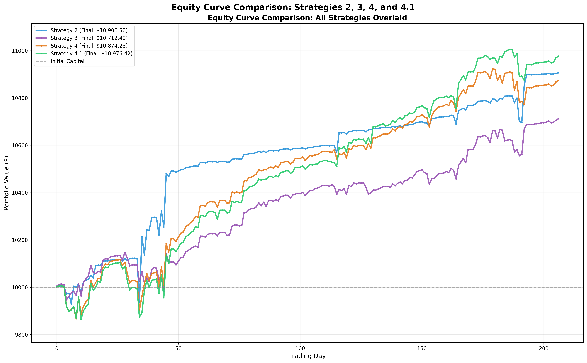
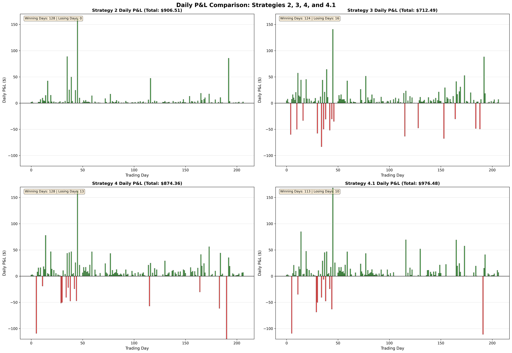

# Strategy 4.1 Report: Progressive Exit with Even Thirds

## Executive Summary

Strategy 4.1 is an enhanced version of Strategy 4 that modifies the exit strategy from a 50%/25%/25% progressive exit to an even thirds (33%/33%/33%) approach. This modification improves overall return while maintaining strong risk management characteristics.

## Strategy Overview

### Key Features
- **Entry Strategy**: Same as Strategy 4 - Progressive accumulation with 3 initial shares, then 3 shares at 0.5% drop, and 6 shares at 1.0% drop
- **Exit Strategy**: Modified to sell in three equal portions (33% each) instead of 50%/25%/25%
- **Stop-Loss**: 1.5% drop from average buy price (before any sells), then first sell price (after 2nd sell)
- **Exit Conditions**: 
  - First sell: 33% when price > avg buy price
  - Second sell: 33% when price > avg buy price (no lower buy signals since last sell)
  - Third sell: Remaining 33% when price > avg buy price (no lower buy signals since last sell)

## Performance Results

### Visual Comparison

#### Equity Curve Comparison

The following chart shows the equity curves for all four strategies side-by-side:

**Key Observations:**
- Strategy 4.1 achieves the highest final portfolio value ($10,976.42)
- Strategy 2 shows steady growth with no drawdowns
- Strategy 3 shows more volatility with stop-loss protection
- Strategy 4 demonstrates progressive exit benefits

#### Daily P&L Comparison

The following chart compares daily P&L across all strategies:

**Key Observations:**
- Strategy 4.1 has the highest total daily P&L ($976.48)
- Strategy 2 has no losing days (perfect win rate)
- Strategy 4.1 shows balanced winning/losing day distribution
- All strategies show positive overall performance

### Overall Performance
- **Initial Capital**: $10,000.00
- **Final Portfolio Value**: $10,976.42
- **Total P&L**: $976.42
- **Return**: **9.76%** (Best among all strategies)

### Trade Statistics
- **Total Trades Executed**: 100
- **Winning Trades**: 89 (89.0%)
- **Losing Trades**: 11 (11.0%)
- **Average P&L per Trade**: $9.76
- **Average Winning Trade**: $7.77
- **Average Losing Trade**: -$59.37
- **Stop-Loss Triggered**: 30 trades (30.0%)

### Risk Metrics
- **Stop-Loss Rate**: 30.0%
- **Average Stop-Loss Trade**: -$19.37
- **Big Losing Days (>$50)**: 5 days
- **Worst Day Loss**: -$110.94

### Daily Performance
- **Total Trading Days**: 207
- **Winning Days**: 113 (54.6%)
- **Losing Days**: 10 (4.8%)
- **Zero P&L Days**: 84 (40.6%)
- **Mean Winning Day P&L**: $13.57
- **Median Winning Day P&L**: $6.33
- **Mean Losing Day P&L**: -$55.50
- **Median Losing Day P&L**: -$48.87

### Cross-Day Trade Performance
- **Total Cross-Day Trades**: 65
- **Cross-Day Wins**: 57 (87.7%)
- **Cross-Day Losses**: 8 (12.3%)
- **Cross-Day Total P&L**: $30.15

## Key Improvements Over Strategy 4

1. **Higher Return**: 9.76% vs 8.74% (+1.02%)
2. **Better Average P&L per Trade**: $9.76 vs $7.47 (+30.7%)
3. **Higher Average Winning Trade**: $7.77 vs $4.92 (+58.0%)
4. **Fewer Total Trades**: 100 vs 117 (-14.5%) - More selective
5. **Better Win Rate**: 89.0% vs 88.0% (+1.0%)
6. **Fewer Big Losing Days**: 5 vs 6 (-16.7%)

### Visual Evidence

The comparison charts above clearly demonstrate Strategy 4.1's superior performance:
- **Equity Curve**: Shows the steepest upward trajectory, ending at the highest portfolio value
- **Daily P&L**: Demonstrates consistent positive performance with the highest cumulative P&L
- **Risk-Adjusted Returns**: Better balance between profit capture and risk management compared to other strategies

## Strategy Characteristics

### Position Management
- **Days with Zero Position at End**: 75 (36.2%)
- **Days with Position at End**: 132 (63.8%)
- **Days with Position Crossing to Next Day**: 130 (62.8%)
- **Average Trades per Day**: 2.41

### Exit Behavior
The even thirds approach provides:
- More balanced position reduction
- Better risk distribution across exits
- Improved profit capture compared to the original 50/25/25 split

## Risk Analysis

### Strengths
1. **Highest Return**: Best performing strategy among all variants
2. **Strong Win Rate**: 89.0% win rate with good risk management
3. **Controlled Losses**: Average stop-loss trade at -$19.37
4. **Consistent Performance**: Good balance between trade frequency and quality

### Areas of Concern
1. **Average Losing Trade**: -$59.37 (larger than Strategy 4's -$54.46)
2. **Stop-Loss Frequency**: 30% of trades hit stop-loss
3. **Cross-Day Risk**: Some positions held overnight with associated risks

## Conclusion

Strategy 4.1 demonstrates that modifying the exit strategy to even thirds (33%/33%/33%) improves overall performance compared to the original 50%/25%/25% approach. The strategy achieves the highest return (9.76%) among all tested strategies while maintaining strong risk management characteristics.

The even thirds exit provides better balance in position reduction and profit capture, resulting in improved average P&L per trade and higher overall returns.

