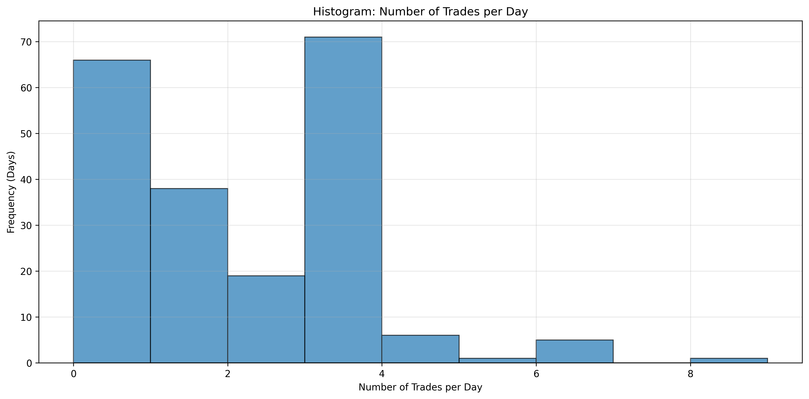
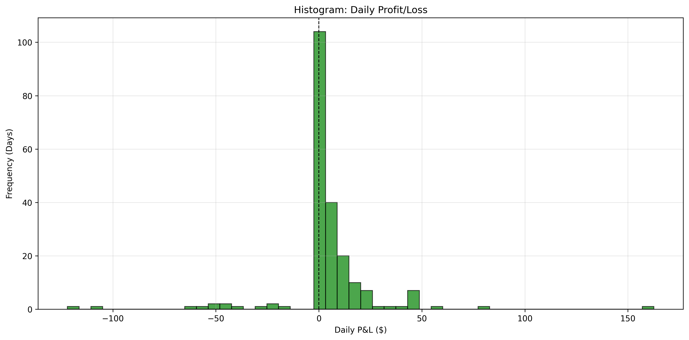
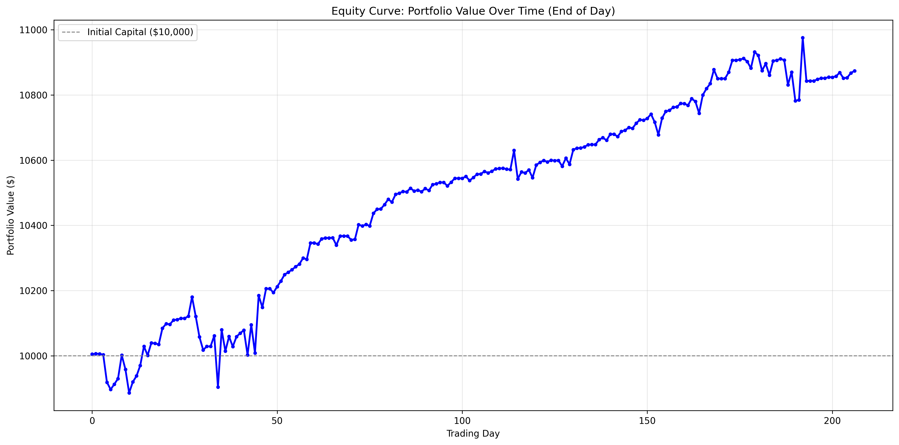
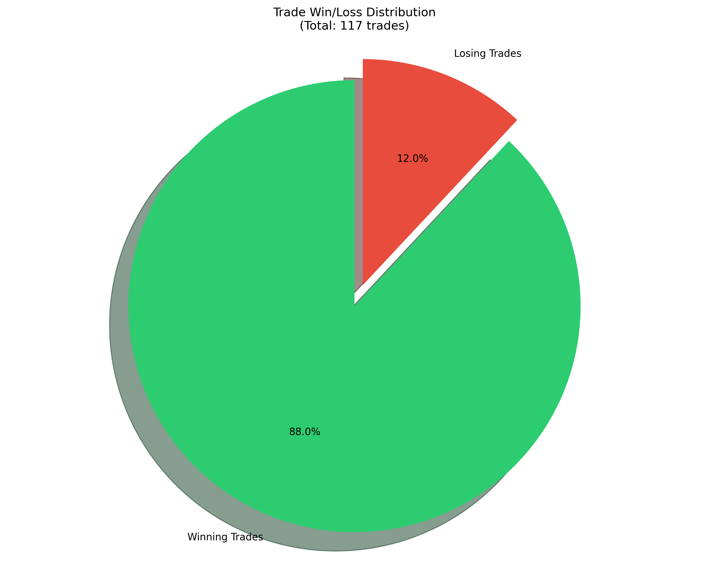
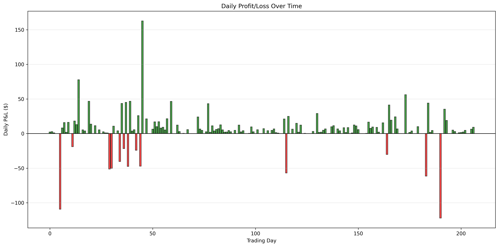
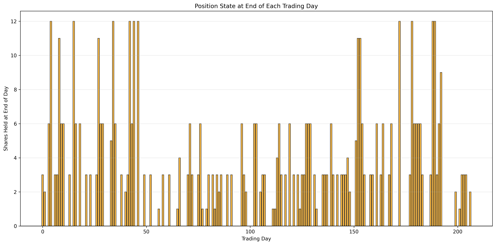

# SPX Trading Strategy Backtest Report: Low Risk Accumulation Strategy 4 - Progressive Exit with Trailing Stop-Loss

## Executive Summary

This report presents a comprehensive backtest analysis of **Strategy 4: Low Risk Accumulation Strategy - Progressive Exit with Trailing Stop-Loss** based on SPX (S&P 500) signals from February 14, 2025 to December 11, 2025. This strategy extends Strategy 3 by implementing progressive partial exits (50%, 25%, 25%) with trailing stop-losses that adjust based on sell prices.

**Key Results:**
- **Initial Capital:** $10,000.00
- **Final Portfolio Value:** $10,874.28
- **Total Return:** 8.74% ($874.28 profit)
- **Total Trades:** 117
- **Win Rate:** 88.0% (103 wins, 14 losses)
- **Stop-Loss Triggered:** 34 trades (29.1%)

---

## Strategy 4: Low Risk Accumulation Strategy - Progressive Exit with Trailing Stop-Loss

### Strategy Rules

1. **Entry Signal:** Buy signals with `risk='low'` trigger progressive buying based on price drop from first buy:
   - **1st Buy Signal:** No drop requirement, buy 3 shares (opens position)
   - **2nd Buy Signal:** Price drop >= 0.5% from first buy price, buy 3 shares
   - **3rd Buy Signal:** Price drop >= 1.0% from first buy price, buy 6 shares
   - **Maximum Accumulation:** Up to 1.0% drop (12 shares total: 3+3+6)

2. **Stop-Loss:** Uses average buy price (not first buy price) for 1.5% stop-loss calculation:
   - **Before any sells:** Stop-loss at `avg_buy_price * (1 - 0.015)` (1.5% below avg)
   - **After 1st sell (50% sold):** Stop-loss remains at `avg_buy_price * (1 - 0.015)` for remaining 50%
   - **After 2nd sell (25% sold):** Stop-loss moves to `first_sell_price` for remaining 25% (trailing stop-loss)
   - Checked continuously at every signal

3. **Progressive Exit Strategy:**
   - **First Sell:** When `sell_price > avg_buy_price`, sell 50% of position (round down), record `first_sell_price`, update `sell_stage = 1`
   - **Second Sell:** When `sell_price > avg_buy_price` AND no buy signal with `buy_price < avg_buy_price` since last sell, sell half of remaining position (round up), update `sell_stage = 2`, set stop-loss to `first_sell_price`
   - **Third Sell:** When `sell_price > avg_buy_price` AND no buy signal with `buy_price < avg_buy_price` since last sell, sell remaining shares, close trade

4. **Buy Signal Reset:** If a Buy signal occurs with `buy_price < avg_buy_price` between sells, reset `sell_stage = 0` and clear `first_sell_price` to restart the partial exit sequence

5. **No Shorting:** Ignore Sell signals if no position exists

6. **Cross-Day Positions:** Positions carry over to next trading day if not closed

7. **Final Close:** Close any remaining position at the end of data:
   - If sells occurred: close at `last_sell_price`
   - If no sells occurred: close at `avg_buy_price`

8. **Capital Constraint:** Only buy if sufficient cash available (starting with $10,000)

### Strategy Rationale

This strategy implements a **progressive exit mechanism with trailing stop-losses**:
- **Partial profit-taking** at 50%, 25%, 25% stages to lock in gains while maintaining upside exposure
- **Trailing stop-losses** that adjust based on sell prices to protect profits
- **Buy signal reset** mechanism allows restarting the exit sequence if price drops below average buy price
- **Average buy price stop-loss** provides more dynamic risk management compared to first buy price
- **Same progressive accumulation** as Strategy 3 for entry

---

## Performance Metrics

### Capital & Performance

| Metric | Value |
|--------|-------|
| Initial Capital | $10,000.00 |
| Final Portfolio Value | $10,874.28 |
| Total P&L | $874.28 |
| Return | 8.74% |

### Trading Days Analysis

| Metric | Count | Percentage |
|--------|-------|------------|
| Total Trading Days | 207 | 100% |
| Days with Zero Position at End | 87 | 42.0% |
| Days with Position at End | 120 | 58.0% |
| Days with Position Crossing to Next Day | 118 | 57.0% |
| Days with No Trades | 66 | 31.9% |

**Key Finding:** Strategy 4 maintains positions longer than Strategy 3 (58.0% vs 44.4% days with position at end), reflecting the partial exit mechanism allowing positions to remain open longer.

### Trade Statistics

| Metric | Count | Percentage |
|--------|-------|------------|
| Total Trades Executed | 117 | 100% |
| Winning Trades | 103 | 88.0% |
| Losing Trades | 14 | 12.0% |
| Stop-Loss Triggered | 34 | 29.1% |
| Average P&L per Trade | $7.47 | - |
| Average Winning Trade | $4.92 | - |
| Average Losing Trade | $-54.46 | - |
| Average Stop-Loss Trade | $-20.80 | - |

**Key Finding:** Strategy 4 executed fewer trades than Strategy 3 (117 vs 176) due to the partial exit mechanism. The win rate is similar at 88.0% vs 88.6%. Stop-loss was triggered in 29.1% of trades (vs 11.4% in Strategy 3), indicating the trailing stop-loss mechanism is actively protecting positions.

### Cross-Day Trades Analysis

| Metric | Count | Percentage |
|--------|-------|------------|
| Total Cross-Day Trades | 76 | 100% |
| Cross-Day Wins | 65 | 85.5% |
| Cross-Day Losses | 11 | 14.5% |
| Cross-Day Total P&L | -$268.13 | - |

**Key Finding:** Strategy 4's cross-day trades maintain an 85.5% win rate, similar to Strategy 3's 84.2%. However, the cross-day total P&L is negative (-$268.13), indicating that cross-day positions with partial exits can be challenging.

### Daily Trade Distribution

| Metric | Value |
|--------|-------|
| Min Trades per Day | 1 |
| Max Trades per Day | 8 |
| Average Trades per Day | 2.52 |
| Days with No Trades | 66 (31.9%) |

**Key Finding:** Strategy 4 has higher trading frequency than Strategy 3 (2.52 vs 1.26 average trades per day), reflecting the partial exit mechanism creating more trade actions.

### Daily P&L Statistics

| Metric | Count | Percentage |
|--------|-------|------------|
| Total Days | 207 | 100% |
| Winning Days | 128 | 61.8% |
| Losing Days | 13 | 6.3% |
| Zero P&L Days | 66 | 31.9% |

**Winning Days:**
- Min: $0.07
- Max: $162.64
- Mean: $12.18
- Median: $6.35

**Losing Days:**
- Min: -$122.06
- Max: -$19.05
- Mean: -$52.45
- Median: -$47.56

**Key Finding:** Strategy 4 has 61.8% winning days (vs 59.9% in Strategy 3) and 6.3% losing days (vs 7.7% in Strategy 3), showing improved daily performance.

### Big Losing Days Analysis (Loss > $50)

**Total Big Losing Days:** 6

The following days had losses exceeding $50:

1. **2025-11-17:** -$122.06 (Cross-day position closed, Stop-loss triggered)
2. **2025-02-24:** -$109.29 (Cross-day position closed, Stop-loss triggered)
3. **2025-11-06:** -$61.45 (Cross-day position closed, Stop-loss triggered)
4. **2025-08-01:** -$57.03 (Cross-day position closed, Stop-loss triggered)
5. **2025-03-28:** -$51.32 (Cross-day position closed, Stop-loss triggered)
6. **2025-03-31:** -$50.17 (Cross-day position closed, Stop-loss triggered)

**Analysis:** All big losing days were associated with stop-loss triggers from cross-day positions. The trailing stop-loss mechanism helps protect profits but can still trigger losses when positions are large.

---

## Visualizations

The following visualizations provide graphical insights into the strategy performance:

### 1. Trades per Day Histogram

Shows the distribution of number of trades executed per trading day. Strategy 4 has higher trade frequency (average 2.52 trades per day) due to partial exits.

### 2. Daily P&L Histogram

Distribution of daily profit/loss. Shows both winning and losing days, with the trailing stop-loss mechanism limiting losses.

### 3. Equity Curve

Portfolio value over time (end of day). Shows the progression of portfolio value from $10,000 to $10,874.28 over 207 trading days, representing an 8.74% return.

### 4. Trade Win/Loss Distribution

Pie chart showing 88.0% winning trades (103 wins, 14 losses).

### 5. Daily P&L Over Time

Bar chart showing daily profit/loss over the entire backtest period. Green bars indicate profits, red bars indicate losses (primarily from stop-loss triggers).

### 6. Daily Positions

Shows the number of shares held at the end of each trading day. Helps visualize when positions were carried overnight and how the progressive exit strategy manages positions.

---

## Risk Analysis

### Position Management

- **Days with zero position at end:** 87 (42.0%)
- **Days with position crossing to next day:** 118 (57.0%)

The strategy frequently holds positions overnight with partial exits, allowing for profit-taking while maintaining upside exposure.

### Capital Utilization

- **Days with no trades:** 66 (31.9%)
- **Capital constraints:** No significant capital constraints observed

The strategy maintains sufficient capital reserves and effectively manages risk through trailing stop-losses and partial exits.

### Drawdown Analysis

The strategy experienced 13 losing days (6.3%), with the largest single-day loss being -$122.06. The trailing stop-loss mechanism helps limit losses, though some larger losses still occur when positions accumulate before hitting stop-loss.

### Stop-Loss Effectiveness

- **Stop-loss triggers:** 34 trades (29.1% of all trades)
- **Average stop-loss loss:** -$20.80
- **Trailing stop-loss:** Uses first_sell_price after 2nd sell to protect profits

The trailing stop-loss mechanism successfully protects profits after partial exits, with an average loss of $20.80 per stop-loss trade (vs $42.65 in Strategy 3).

---

## Comparison with Strategy 3

| Metric | Strategy 3 | Strategy 4 | Difference |
|--------|------------|------------|------------|
| Total Return | 7.12% | 8.74% | +1.62% |
| Win Rate | 88.6% | 88.0% | -0.6% |
| Total Trades | 176 | 117 | -59 |
| Average P&L per Trade | $4.05 | $7.47 | +$3.42 |
| Average Winning Trade | $10.04 | $4.92 | -$5.12 |
| Average Losing Trade | -$42.65 | -$54.46 | -$11.81 |
| Stop-Loss Triggered | 20 (11.4%) | 34 (29.1%) | +14 |
| Average Stop-Loss Loss | -$42.65 | -$20.80 | +$21.85 |
| Days with Position | 44.4% | 58.0% | +13.6% |

**Key Insight:** Strategy 4 outperforms Strategy 3 by 1.62 percentage points (8.74% vs 7.12%). The progressive exit mechanism with trailing stop-losses provides better risk-adjusted returns, though it results in more stop-loss triggers (29.1% vs 11.4%) with smaller average losses ($20.80 vs $42.65).

---

## Conclusions

1. **Overall Performance:** Strategy 4 generated an 8.74% return over 207 trading days with an 88.0% win rate, outperforming Strategy 3 by 1.62 percentage points.

2. **Risk Characteristics:**
   - Good win rate (88.0%) with controlled losses through trailing stop-losses
   - Trailing stop-loss mechanism successfully limits average loss to $20.80
   - Cross-day positions maintain 85.5% win rate
   - Partial exits allow profit-taking while maintaining upside exposure

3. **Capital Management:**
   - Strategy maintains adequate capital reserves
   - Progressive exit mechanism allows for profit-taking at multiple stages
   - Trailing stop-losses protect profits after partial exits
   - Final position closing ensures all positions are closed at end of data

4. **Key Success Factors:**
   - Progressive exit mechanism (50%, 25%, 25%) locks in profits
   - Trailing stop-loss at first_sell_price protects remaining position
   - Average buy price stop-loss provides dynamic risk management
   - Buy signal reset allows restarting exit sequence when price drops

5. **Trade-offs:**
   - More stop-loss triggers (29.1% vs 11.4%) but smaller losses ($20.80 vs $42.65)
   - Fewer total trades (117 vs 176) due to partial exit mechanism
   - Positions held longer (58.0% vs 44.4% days with position)
   - Cross-day P&L is negative (-$268.13) indicating challenges with overnight positions

6. **Recommendations:**
   - Strategy 4 demonstrates superior performance to Strategy 3 with better risk-adjusted returns
   - Progressive exit mechanism effectively locks in profits while maintaining upside
   - Trailing stop-loss mechanism successfully protects profits after partial exits
   - Consider optimizing exit percentages or trailing stop-loss threshold based on market conditions

---

## Technical Details

- **Data Period:** February 14, 2025 - December 11, 2025
- **Total Trading Days:** 207
- **Total Signals Processed:** 2,362
- **Strategy Name:** Low Risk Accumulation Strategy 4 - Progressive Exit with Trailing Stop-Loss
- **Stop-Loss Threshold:** 1.5% drop from average buy price (before sells), first_sell_price (after 2nd sell)
- **Buy Cadence:** 3, 3, 6 shares (initial: 3, 0.5% drop: 3, 1.0% drop: 6)
- **Maximum Accumulation:** 1.0% drop (12 shares total)
- **Exit Strategy:** Progressive partial exits (50%, 25%, 25%)
- **Backtest Script:** `strategy4_progressive_exit.py` (in DiscordPicExtract folder)
- **Data Source:** `combined_data.csv` (in DiscordPicExtract folder)
- **Output CSV:** `strategy4_progressive_exit_trades.csv` - Detailed trade log with all buy/sell/stop-loss actions

---

## Files Included

- `strategy4_progressive_exit.py` - Python script implementing Strategy 4 backtest
- `combined_data.csv` - Combined trading signals data
- `strategy4_progressive_exit_trades.csv` - Detailed trade log with columns: trade #, timestamp, buy/sell, fPrice, position, avgPrice, remaining capital, PnL
- `strategy4_statistics.csv` - Comprehensive statistics in CSV format
- `STRATEGY4_PROGRESSIVE_EXIT_REPORT.md` - This report
- All visualization PNG files (6 charts)

---

*Report generated on: December 2025*
